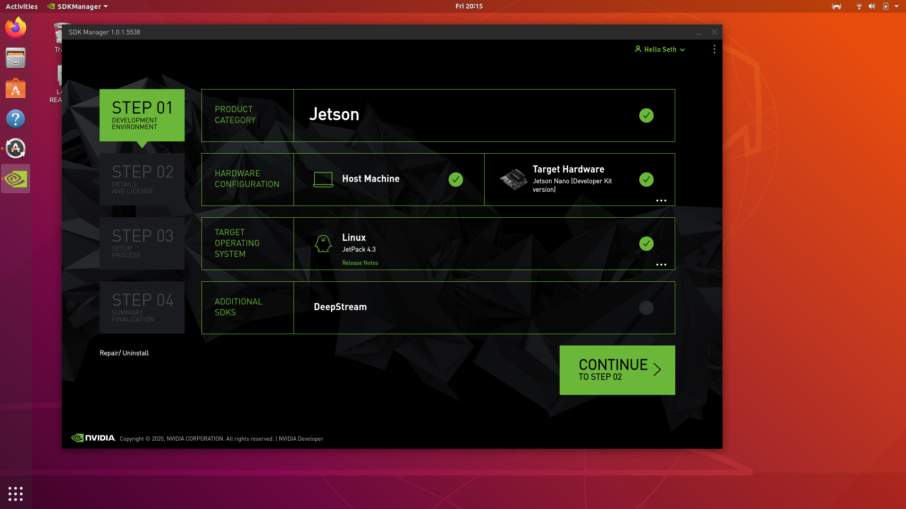
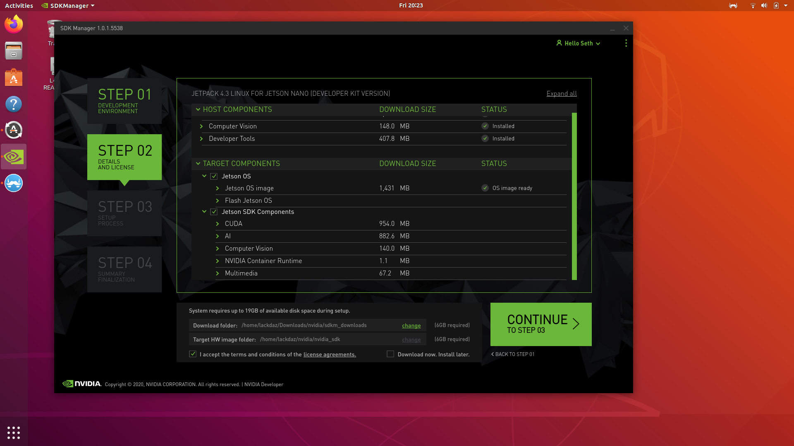
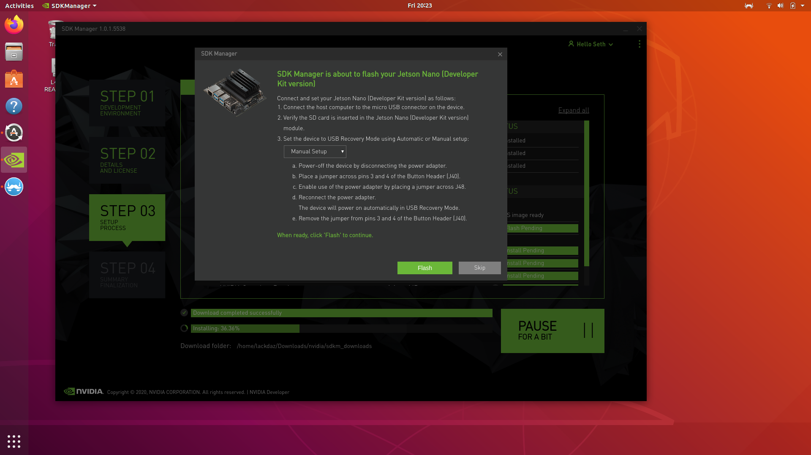
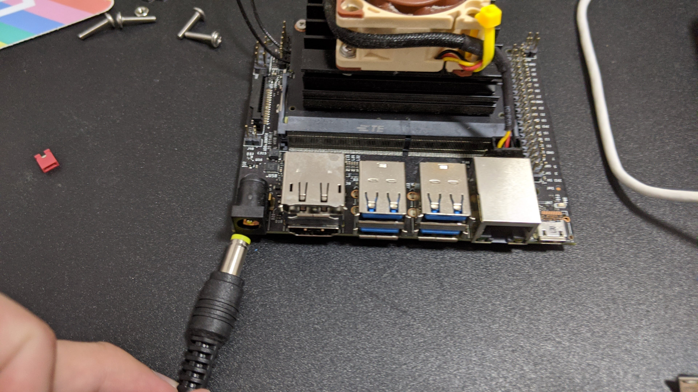
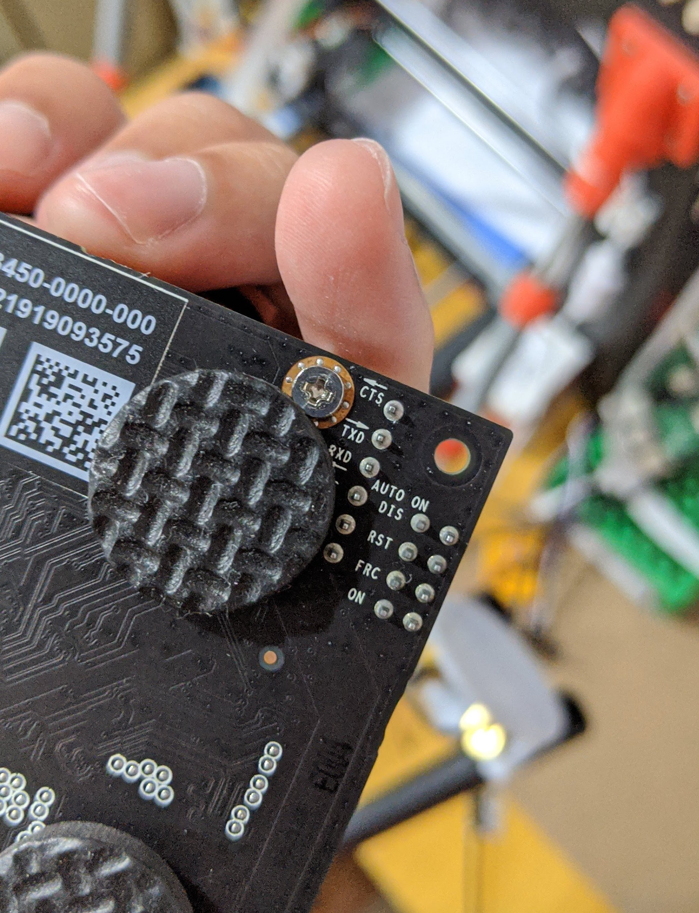
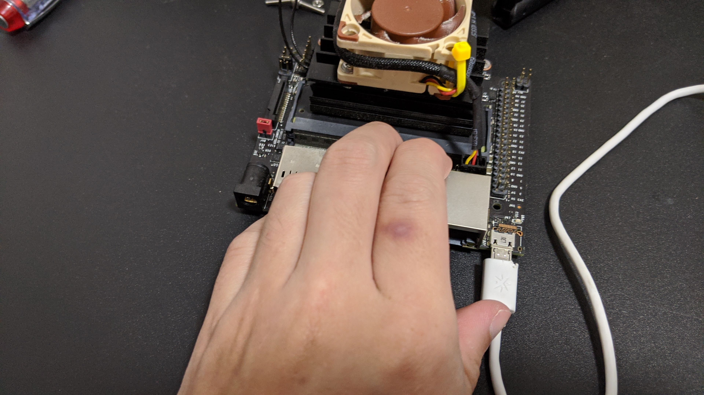
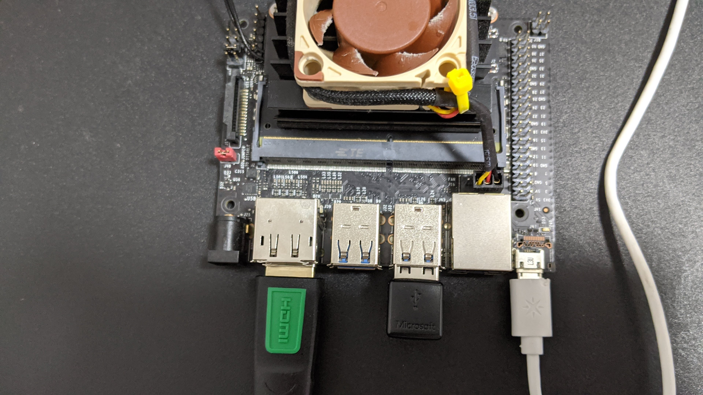
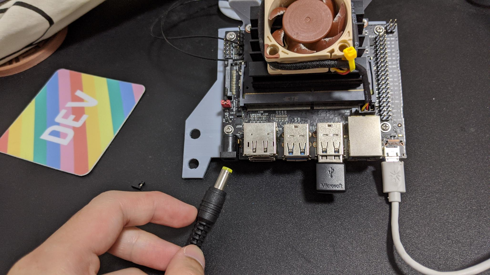
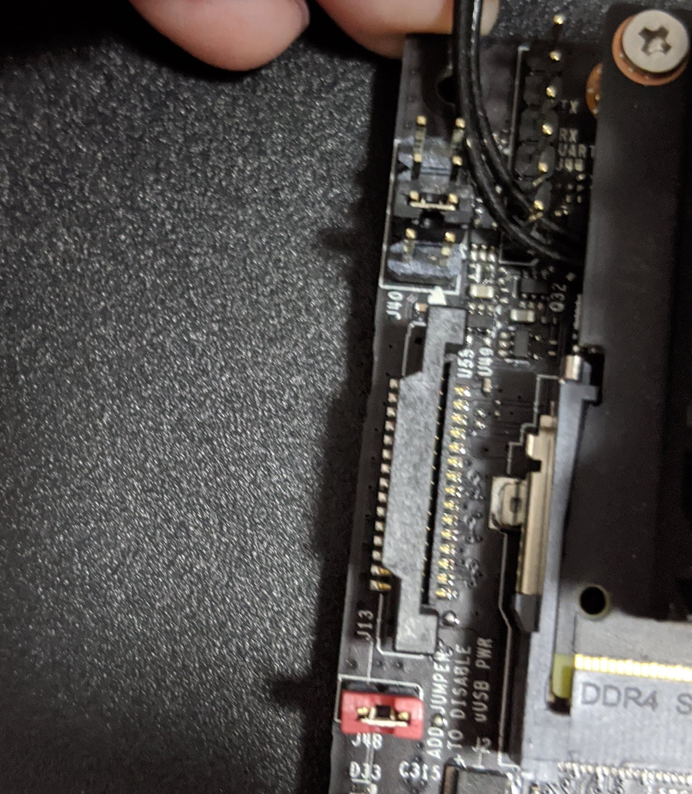
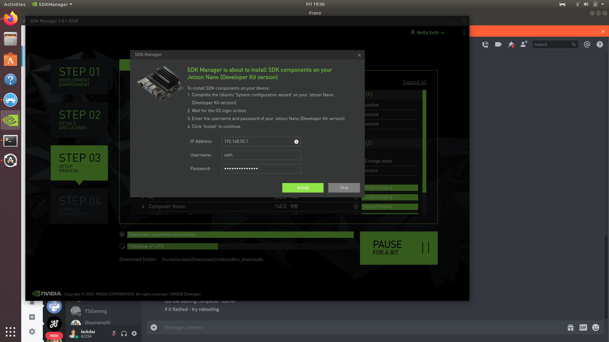

What You Need:
--
1. DC 5V/4A Barrel Jack Power Adapter* - [Makersupplies](https://www.makersupplies.sg/collections/jetson-nano-and-accessories/products/5v-4a-5-5-x-2-1mm-barrel-connector-power-adapter)
1. HDMI Monitor
1. Wireless Keyboard and Mouse*
1. USB-A to micro-usb adapter **with dataline**
1. Jumpers - [aliexpress](https://www.aliexpress.com/item/32976996798.html?spm=a2g0o.productlist.0.0.2f36333festGXT&algo_pvid=b73ffa60-b241-4cc8-b8ca-ec898f566e24&algo_expid=b73ffa60-b241-4cc8-b8ca-ec898f566e24-7&btsid=0ab6f81615871249489384053e7f9e&ws_ab_test=searchweb0_0,searchweb201602_,searchweb201603_)
1. Wireless network adapter, M2(see below) or USB(not recommended*)

You can also get these additional hardware for a higher quality-of-life (QOL) development experience:

1. M2 slot Wireless Adapter - [Makersupplies](https://www.makersupplies.sg/collections/jetson-nano-and-accessories/products/intel-dual-band-wireless-ac-8265-module-with-antennas)

*If using the 4A DC jack, the USB wireless adapter and bluetooth wireless transceivers tend to suffer interference from the adjacent power jack related to grounding issues. Related symptoms: keyboard/mouse stutter and network loss.

Flashing the SD Card
--
1. Download the Nvidia SDK Manager onto a Debian machine (Ubuntu Desktop 16.04 and 18.04 on x64 system
) or emulator. Download link [here](https://developer.nvidia.com/nvidia-sdk-manager)
1. Run the SDK Manager, choose the right platforms, as seen below and proceed to the next step:

    
    Remember to choose NVIDIA **Jetson Nano (Developer Kit Version)** and not Jetson Nano (Production version)
1. Select Jetson OS and Jetson SDK Components and the downloads will commence (will take some time). Continue to the next step.

    
    
1. These steps are tricky. You can follow along with the instructions shown but there are some gotchas. First, you can only use 'Manual Mode' because automatic doesn't work with a SD card that isn't already flashed with the OS. So go ahead and select **Manual Mode**. I'll go step-by-step from here.

    

    Remember to choose NVIDIA **Jetson Nano (Developer Kit Version)** and not Jetson Nano (Production version)
1. First unpower the device by removing the DC jack. Remove all peripherals if you haven't done so already

    

1. Next, attach a jumper to the J48 pin. This changes the power draw from micro-usb to the barrel jack.

    

1. Then, attach the jumper to the J40 pins as pictured (second row from the camera slot).

    

    This boots the Nano is USB recovery mode. If you are not sure, you can always flip the board around to check the labels and look for **RST**(pictured below)

    

1. Now, connect the USB-A to micro-usb adapter from the Nano to your x86 host machine.

    

Also connect your mouse/keyboard wireless transceiver and HDMI display adapter.

    
    
1. Finally connect the DC barrel jack and power on! A green light should appear and the end result should look something like this:

     // TODO: Better photo needed here

1. The SDK Manager should automatically start flashing the SD card. Meanwhile you can remove the J40 jumper(pictured black)

    

1. When the progress bar hits about 42%. A prompt should appear asking to complete the Configuration Wizard.

    

    Now switch to the Nano display and a GUI should appear. Complete the configuration steps until the wizard is completed. Switch over to the x86 Host Machine once you have set your username and password and key this into the SDK Manager (and ignore the IP address)
1. The SDK Manager will now proceed to install the additional SDK Components, so just wait until its completed.

Setting Static IP
--


Setting Up SSH Access
--
On your local x86 machine:
- `ssh-copy-id -i ~/.ssh/id_rsa <nano-ip>`
- Key in your nano's password and the ssh keys will be added to `~/.ssh/known_hosts`
- Try: `ssh -X username@<nano-ip>` and you should now have passwordless login

On your Nano:
- You might have to change some sshd settings in `sudo vim /etc/ssh/sshd_config`

Setting up VS Code Remote Development on the Nano
--
This is absolutely useful if you wish to run the nano headless and modify on the nano directly

Start an elevated session
- `sudo -s`

Install the community repo key
- `apt-key adv --keyserver keyserver.ubuntu.com - --recv-keys 0CC3FD642696BFC8`

Run the installation script
- `. <( wget -O - https://code.headmelted.com/installers/apt.sh )`

Disable Lock Screen
--
- Run `gsettings set org.gnome.desktop.screensaver lock-enabled false
`

Enable auto-login
- Even though the auto-login is enabled on the GUI settings. It needs a retoggle to work. Run `sudo vim /etc/gdm3/custom.conf` and make sure the `AutomaticLoginEnable` flag is `True` and uncommented, as follows.
    ```
    [daemon]
    AutomaticLoginEnable=True
    AutomaticLogin=user
    ```
    or if you are lazy:

    ```
    sudo sed -i '/AutomaticLoginEnable*/s/^#//; s/False/True/' /etc/gdm3/custom.conf && sed -i '/AutomaticLogin=*/s/^#//' /etc/gdm3/custom.conf
    ```

Create Swap File
--
The default nano swapfile is 2GB. You can see this by running: `zramctl`

You will notice that there are four entries (one for each CPU of the Jetson Nano) /dev/zram0 - /dev/zram3. Each entry has an allocated amount of swap memory associated with it, by default 494.6M, for a total of around 2GB. This is half the size of the main memory. You will find this to be adequate for most tasks, but not for dockerised applications. To increase the swapfile size, we are going to use the Jetson Nano convenice script:
- `git clone https://github.com/JetsonHacksNano/resizeSwapMemory utilities && cd utilities`
- Then to increase to 8gb: `./setSwapMemorySize.sh -g 8` 
- Finally, reboot for the changes to take effect: `sudo reboot`

Git
--
- `$ git config --global user.name "user"`
- `$ git config --global user.email "user@gmail.com"`
- `git config credential.helper store` or `git config --global credential.helper store` (global)
- `git push` in the github repositories you want your credentials saved

Git Submodules
--
- Run: `git clone https://github.com/lackdaz/wallaby.git --recursive`

A Better Git log/tree (Optional)
--
- check https://gist.github.com/lackdaz/1843c3580612773f4d70b5ab91026d7a

Installing Yarn (Optional)
--
Required for node package management
- Run: curl -s https://gist.githubusercontent.com/lackdaz/15f929aeb0fee44369af1d96635769b8/raw/a23a0c604f1236cb1ae709da9930dc0922b6cdb0/install-node-yarn-arm.sh | bash /dev/stdin param1 param2

Upgrading Docker to 19.03
--
- To upgrade docker: `curl -sSL https://get.docker.com/ | sh`
- To install docker-compose: 
    - `sudo apt-get update`
    - `sudo apt-get install -y python-pip python-dev libffi-dev libssl-dev libxml2-dev libxslt1-dev libjpeg8-dev zlib1g-dev`
    - `sudo pip install docker-compose=="1.25.5"` (latest)
- To check docker version: `sudo docker version`
- To check compose version: `sudo docker-compose version`

